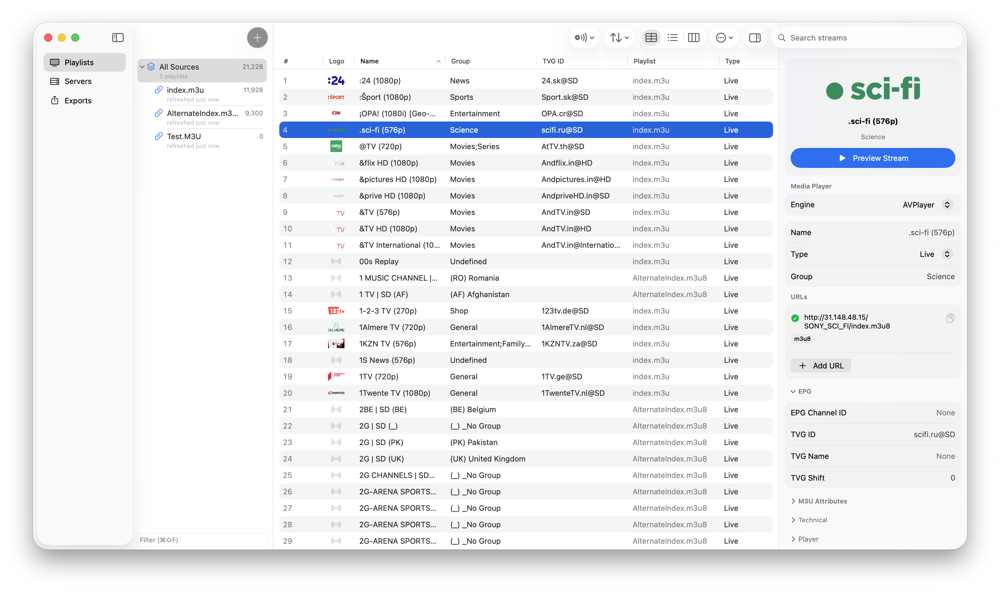

# Streamline — IPTV & M3U Editor

> **Note:** This repo previously hosted Streamline's landing page. The site has moved to [**shallowapps.com/streamline**](https://shallowapps.com/streamline). The pages here now redirect to the new URL — kept only so old links (App Store, social, bookmarks) keep working.

🌐 **[Visit the landing page](https://shallowapps.com/streamline)**

🛒 **[Download on the App Store](https://apps.apple.com/us/app/streamline-iptv-m3u-editor/id6760606054?mt=12)**

- Import M3U/M3U8 playlists from a URL or file, or connect via Xtream Codes
- Browse, search, and bulk-edit thousands of streams instantly
- Smart refresh detects conflicts between your edits and server changes
- Built-in local server streams your playlist to any IPTV player on the network
- Export to M3U, M3U8, JSON, or XSPF
- iCloud sync keeps your library in sync across Mac and iPhone
